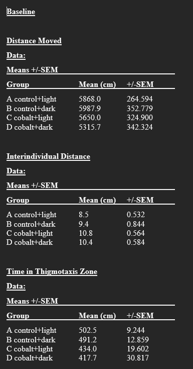
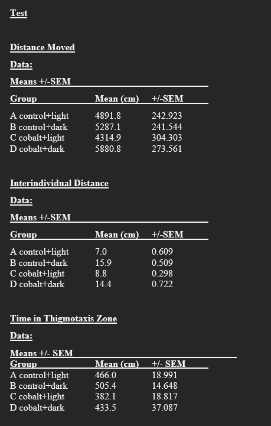
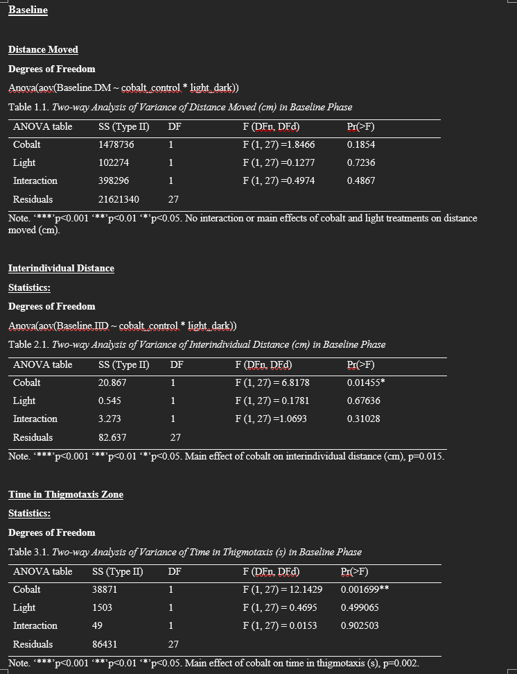
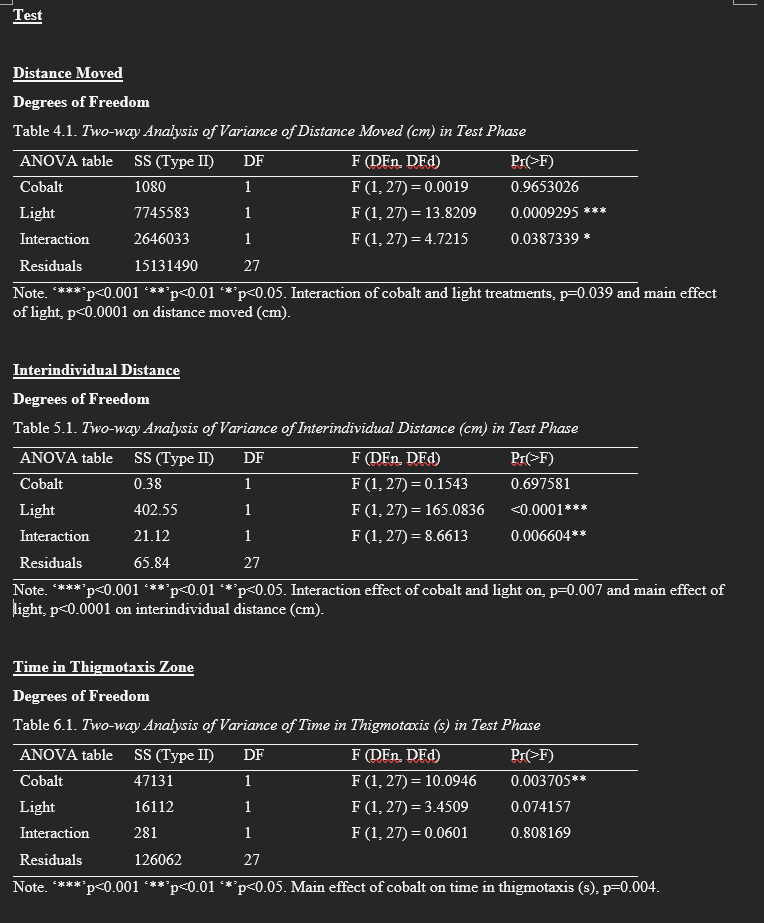
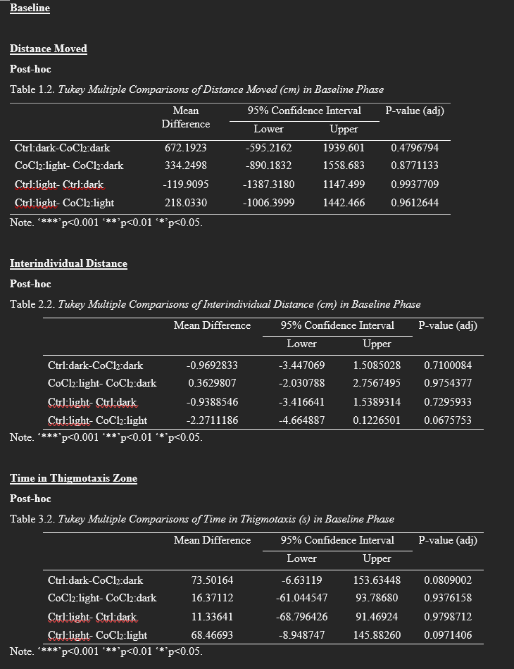
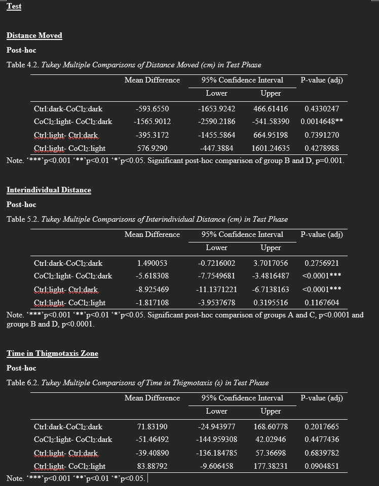

Paper: SL Chaput, WW Burggren, PL Hurd, TJ Hamilton. 2023. Zebrafish (Danio rerio) shoaling in light and dark conditions involves a complex interplay between vision and lateral line. Behavioural Brain Research, Vol 439: 114228. DOI: https://doi.org/10.1016/j.bbr.2022.114228.

# Introduction
### Abstract 
It is unknown how fish are able to shoal (swim in groups) in the dark. It is suggested that both the visual and lateral line systems are involved in shoaling behavior. In this study, zebrafish were treated with CoCl2 which inhibits lateral line function. The fish were then tested in light and dark conditions to see how lateral line ablation affected their ability to maintain shoals. It was found that lateral line ablation reduced, but did not eliminate, shoaling behavior. Therefore, the visual and lateral line systems both contribute to maintaining fish shoals. 

### Experimental set up 
Fish shoals consisted of 5 individuals. Each shoal was assigned to one of four experimental groups: 
  Control+Light (n=8)
  Control+Dark (n=7)
  CoCl2+Light (n=8)
  CoCl2+Dark (n=8) 
"Control" refers to shoals with no treatment, while "CoCl2" refers to shoals with ablated lateral line system. "Light" and "Dark" refer to the lighting conditions shoals were tested in. 
Each behavioral trial consisted of a 10min "Baseline" period where all shoals were recorded under light conditions. The later part of the trial was the "Test" period where shoals were observed under light or dark conditions as determined by their treatment group. 
The shoaling metrics measured were 1) distanced moved (cm), 2) Time in thigmotaxis zone (hugging walls of the tank) (sec), 3) interindividual distance (cm). These were recorded for both the Baseline and Test periods. 

### Data Analysis
For the descriptive statistic, we will calculate the mean and standard error for each metric for each treatment group. We will replicate Figure 2 which consists of bar graphs comparing the shoaling metrics across treatments. Lastly, we will re-run the 2-way ANOVA on the data. 

### Descriptive statistics
Load in libraries
```{r, message=FALSE, warning=FALSE}
library(tidyverse)
library(car)
library(knitr)
```
Load in data
```{R}
#Read in data
f<-"https://raw.githubusercontent.com/SarahArtemis/Data-Analysis-Replication/main/Data/Zebrafish%20shoaling%20data%20tidy.csv"
d<-read.csv(f, header = TRUE)
head(d)

#Split "Treatment" into two columns. 
d<-d%>%
  separate(Treatment, c('Treatment', 'Light'))%>%
  mutate(Group=paste(Treatment, Light, sep=" "))

#Create second data frame for the ANOVA. Split dataframe based on "Assay".          
 s<- d%>% split(d$Assay)
head(s)
```

Calculate Mean and SE for each treatment
```{R, message=FALSE, warning=FALSE}
#Create SE function
SE=function(x){sd(x)/sqrt(length(x))}

#Calculate Mean and SE
MSE<-d%>%
  drop_na(IID..cm., Time.Thigmotaxis..s., Distance.Moved..cm.)%>%
  group_by(Treatment, Light, Group, Assay)%>%
  summarise(mean_IID=mean(IID..cm.), mean_Thig=mean(Time.Thigmotaxis..s.),mean_DM=mean(Distance.Moved..cm.), SE_IID=SE(IID..cm.), SE_Thig=SE(Time.Thigmotaxis..s.),SE_DM=SE(Distance.Moved..cm.))
MSE
```
Compare Means and SE. Note that the paper means and SEs are grouped by Assay (Baseline and Test)

```{r echo=FALSE, width="100px"}

#Baseline stats



#Test stats


```

All means and SEs match.

### Replicate Fig 2: bar graphs
```{R}

#Bar graph for interindividual distance
IID<-ggplot(MSE, aes(x=Group, y=mean_IID, fill=Light)) +
  geom_bar(position="dodge",stat="identity")+theme_minimal()+
  theme(axis.text.x = element_text(angle = 45))+
  geom_errorbar( aes(x=Group, ymin=mean_IID-SE_IID, ymax=mean_IID+SE_IID))+
  facet_wrap(vars(Assay))


#Bar graph for time in thigmotaxis zone
Thig<-ggplot(MSE, aes(x=Group, y=mean_Thig, fill=Light)) +
  geom_bar(position="dodge",stat="identity")+theme_minimal()+
  theme(axis.text.x = element_text(angle = 45))+
  geom_errorbar( aes(x=Group, ymin=mean_Thig-SE_Thig, ymax=mean_Thig+SE_Thig))+
  facet_wrap(vars(Assay))


#Bar graph for distance moved
DM<-ggplot(MSE, aes(x=Group, y=mean_DM, fill=Light)) +
  geom_bar(position="dodge",stat="identity")+theme_minimal()+
  theme(axis.text.x = element_text(angle = 45))+
  geom_errorbar( aes(x=Group, ymin=mean_DM-SE_DM, ymax=mean_DM+SE_DM))+
  facet_wrap(vars(Assay))

IID
Thig
DM

```

Compare Figure 2

```{r echo=FALSE, width="100px"}
knitr::include_graphics("images/Fig2.PNG")
```

Most aspects of the figure match what is reported in the paper. The replicate is only missing the significance stars.

### Inferential statistics
Run 2-way ANOVA
```{R}
#Use the s dataframe for this 

#Run ANOVA for Baseline data

#Interindividual distance
Anova(aov(IID..cm. ~ Treatment * Light, data = s$Baseline))
#Time in thigmotaxis zone
Anova(aov(Time.Thigmotaxis..s. ~ Treatment * Light, data = s$Baseline))
#Distance moved
Anova(aov(Distance.Moved..cm. ~ Treatment * Light, data = s$Baseline))

#Run ANOVA for Test data

#Interindividual distance
(Anova(aov(IID..cm. ~ Treatment * Light, data = s$Test)))
#Time in thigmotaxis zone
(Anova(aov(Time.Thigmotaxis..s. ~ Treatment * Light, data = s$Test)))
#Distance moved
(Anova(aov(Distance.Moved..cm. ~ Treatment * Light, data = s$Test)))
```
Compare ANOVA output (note the results are grouped by assay)

```{r echo=FALSE, width="100px"}
#Baseline


#Test

```

All p-values and significant comparisons are the same. 

Run Post-hoc Tukey test
```{R}

#Run Tukey for Baseline data

#Interindividual distance
TukeyHSD(aov(IID..cm. ~ Treatment * Light, data = s$Baseline), conf.level=.95)
#Time in thigmotaxis zone
TukeyHSD(aov(Time.Thigmotaxis..s. ~ Treatment * Light, data = s$Baseline), conf.level=.95)
#Distance moved
TukeyHSD(aov(Distance.Moved..cm. ~ Treatment * Light, data = s$Baseline), conf.level=.95)

#Run Tukey for Test data

#Interindividual distance
TukeyHSD(aov(IID..cm. ~ Treatment * Light, data = s$Test), conf.level=.95)
#Time in thigmotaxis zone
TukeyHSD(aov(Time.Thigmotaxis..s. ~ Treatment * Light, data = s$Test), conf.level=.95)
#Distance moved
TukeyHSD(aov(Distance.Moved..cm. ~ Treatment * Light, data = s$Test), conf.level=.95)
```
Compare Tukey results (note the results are grouped by assay)

```{r echo=FALSE, width="100px"}
#Baseline


#Test

```

All (relevant) p-values and significant comparisons are the same. Note that the replicated Tukey test has a couple extra comparisons (Control:Light - CoCl2:Dark and CoCl2:Light-Control:Dark). Based on the aim of the study, these comparisons are not relevant and were likely not reported in the paper for this reason. 

### Summary
Overall the data replication went very well. I was able to replicate the means and SEs that were reported in the paper. The basics of figure were simple to recreate. The 2-way ANOVA and Tukey Test also returned the same values that were reported in the paper's supplementary material. The only issue was recreating the aesthetics of the figure. This could be because they stated in the paper that they made their figures using Graphpad Prism instead of in R. For example, the treatments listed across the x-axis are in a different order as the figure in the paper. I tried rearranging the rows in the MSE dataframe to solve this but it did not help. I also attempted to add the significance stars using geom_signif() and stat_compare_means(), but this also proved to be tricky. The functions would place the significance bar on both the baseline and test graphs when it needed to only be on one. However, the main aspects of the figure (figure type, SE bars, and data trends) match what is reported in the paper. 